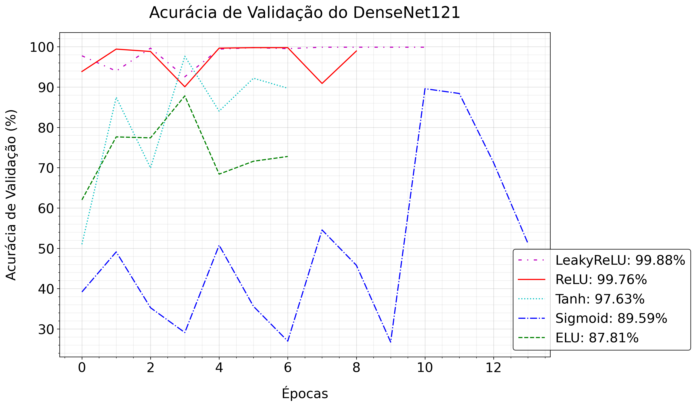

# Classificação de Regiões Terrestres através de Imagens de Satélite e Deep Learning

## 📌 1. Introdução

O planeta Terra é um mosaico complexo e vibrante de diferentes regiões, cada uma com suas próprias características únicas. Compreender essas regiões e suas interações é fundamental para uma variedade de aplicações, desde o monitoramento ambiental até a planejamento urbano.

Neste projeto, exploramos a aplicação de técnicas de Deep Learning para a classificação de diferentes tipos de regiões terrestres usando imagens de satélite. As imagens de satélite oferecem uma visão abrangente e objetiva da superfície da Terra, tornando-as uma ferramenta valiosa para este tipo de análise.

Utilizamos uma arquitetura de Rede Neural Convolucional (CNN) para o nosso modelo de Deep Learning, que é treinado com um conjunto diversificado de imagens de satélite. O modelo é então capaz de classificar novas imagens em várias categorias, identificando características como florestas, corpos d’água, áreas urbanas e muito mais.

Este projeto não só demonstra o poder do Deep Learning na análise e interpretação de imagens de satélite, mas também serve como um exemplo prático da aplicação dessas técnicas em um contexto do mundo real. Esperamos que este trabalho possa inspirar outros a explorar ainda mais as possibilidades oferecidas pelo Deep Learning na análise de imagens de satélite.

## ⚙️ 2. Configurações de Ambiente 

Antes de começarmos a construir e treinar nossa rede neural, precisamos configurar nosso ambiente. Isso envolve várias etapas importantes que garantem que nosso código seja executado corretamente e nossos experimentos sejam reproduzíveis.

### 2.1 Instalação e Carga de Pacotes

- **os**: Esta é uma biblioteca padrão do Python que fornece funções para interagir com o sistema operacional, incluindo a leitura de variáveis de ambiente, manipulação de diretórios e arquivos.
- **warnings**: Outra biblioteca padrão do Python usada para emitir avisos e controlar se eles são ignorados ou não.
- **numpy**: Uma biblioteca fundamental para a computação científica em Python. Ela fornece suporte para arrays multidimensionais, matrizes e uma grande coleção de funções matemáticas de alto nível.
- **seaborn** e **matplotlib**: São bibliotecas de visualização de dados em Python que fornecem uma interface de alto nível para desenhar gráficos estatísticos atraentes e informativos.
- **torchvision**: Uma parte do ecossistema PyTorch, torchvision é usada para carregar e preparar conjuntos de dados de imagens, além de fornecer alguns modelos pré-treinados.
- **torch**: É uma biblioteca de aprendizado profundo de código aberto que fornece uma interface flexível e eficiente para algoritmos de aprendizado profundo e usa a biblioteca de matrizes Tensor do Google.
- **torchmetrics**: É uma biblioteca que fornece métricas para avaliação de modelos PyTorch, neste caso, a precisão da classificação.
- **lightning**: PyTorch Lightning é uma estrutura leve que organiza o código PyTorch, fornecendo abstração para treinamento, validação, teste e previsão enquanto mantém total controle e simplicidade.

## 🤖 3. Modelagem Com DenseNet121

### 3.1 Introdução à Arquitetura DenseNet121

DenseNet, abreviação de Densely Connected Convolutional Networks, é uma arquitetura de rede neural inovadora que utiliza conexões densas entre as camadas para aprimorar o desempenho das redes neurais convolucionais. Essa arquitetura avançada tem demonstrado eficácia significativa em uma ampla gama de tarefas de visão computacional, como classificação de imagens, detecção de objetos e segmentação.

A arquitetura DenseNet121 é uma variante específica da DenseNet que consiste em várias camadas convolucionais. Cada camada é seguida por uma operação de concatenação que combina a entrada de todas as camadas anteriores. Em resumo, a DenseNet121 é composta pelas seguintes camadas:

- 1 convolução 7x7

- 58 convoluções 3x3

- 61 convoluções 1x1

- 4 AvgPool

- 1 camada totalmente conectada

Uma característica distintiva da DenseNet é que cada camada está diretamente conectada a todas as outras camadas. Portanto, para 'L' camadas, existem L (L+1)/2 conexões diretas. Isso contrasta com as redes neurais convencionais, onde cada camada está conectada apenas à próxima camada.

Outro componente importante da DenseNet são os DenseBlocks. A operação de concatenação não é viável quando o tamanho dos mapas de recursos muda. No entanto, uma parte essencial das CNNs é a redução de dimensionalidade das camadas, que reduz o tamanho dos mapas de recursos para obter velocidades de computação mais altas. Para permitir isso, as DenseNets são divididas em DenseBlocks, onde as dimensões dos mapas de recursos permanecem constantes dentro de um bloco, mas o número de filtros entre eles é alterado.

: Huang, G., Liu, Z., Van Der Maaten, L., & Weinberger, K. Q. (2017). Densely connected convolutional networks. In Proceedings of the IEEE conference on computer vision and pattern recognition (pp. 4700-4708).

### 3.2 Estrutura do DenseNet121

#### 3.2.1. Algoritmo de Otimização Adamax

Adamax é uma variante do algoritmo de otimização Adam, que é baseado em estimativas adaptativas de momentos de ordem inferior. Enquanto Adam usa a média móvel exponencial do gradiente e do quadrado do gradiente para calcular as taxas de aprendizado adaptativas para cada parâmetro, Adamax usa a norma infinita dos gradientes passados para o cálculo da taxa de aprendizado.

Aqui estão as equações matemáticas que definem o algoritmo Adamax:

Dado um gradiente $g_t$ no tempo $t$, o algoritmo Adamax atualiza os parâmetros $\theta$ da seguinte maneira:

1. Atualiza a média móvel exponencial do gradiente:

$$m_t = \beta_1 m_{t-1} + (1 - \beta_1) g_t$$

2. Atualiza a norma infinita dos gradientes passados:

$$u_t = \max(\beta_2 u_{t-1}, |g_t|)$$

3. Atualiza os parâmetros:

$$\theta_{t+1} = \theta_t - \frac{\eta}{u_t} m_t$$

##### Definições dos termos

- $\beta_1$: É o hiperparâmetro que controla a taxa de decaimento da média móvel exponencial do gradiente. Ele geralmente é definido como um valor próximo a 1 (por exemplo, 0.9).

- $\beta_2$: É o hiperparâmetro que controla a taxa de decaimento da norma infinita dos gradientes passados. Ele também é geralmente definido como um valor próximo a 1 (por exemplo, 0.999).

- $\eta$: É a taxa de aprendizado. Este é um hiperparâmetro que determina o tamanho do passo que o algoritmo dá em cada iteração.

- $m_t$: É a média móvel exponencial do gradiente no tempo $t$. Ela é calculada como uma média ponderada do gradiente atual e da média móvel exponencial anterior.

- $u_t$: É a norma infinita dos gradientes passados até o tempo $t$. Ela é calculada como o máximo entre a norma infinita anterior e o valor absoluto do gradiente atual.

- $g_t$: É o gradiente no tempo $t$. Ele é calculado a partir da função de perda.

#### 3.3.2. Função de Perda Cross Entropy

A função de perda de entropia cruzada é uma função de perda amplamente utilizada em aprendizado de máquina, especialmente em problemas de classificação. Ela é usada para quantificar a diferença entre duas distribuições de probabilidade. A ideia principal por trás da entropia cruzada é medir o nível de dissimilaridade entre a distribuição de probabilidade prevista pelo modelo e a distribuição de probabilidade verdadeira.

Aqui estão as equações matemáticas que definem a função de perda de entropia cruzada:

Dado um vetor de rótulos verdadeiros $y$ e um vetor de previsões $\hat{y}$, a função de perda de entropia cruzada $L$ é calculada da seguinte maneira:

$$L = -\sum_{i} y_i \log(\hat{y}_i)$$

##### Definições dos termos

- $y_i$: É o i-ésimo elemento do vetor de rótulos verdadeiros. Em um problema de classificação multiclasse, $y_i$ é geralmente 1 para a classe correta e 0 para todas as outras classes.

- $\hat{y}_i$: É o i-ésimo elemento do vetor de previsões. Ele representa a probabilidade prevista da i-ésima classe.

- $\log(\hat{y}_i)$: É o logaritmo natural da probabilidade prevista da i-ésima classe. O logaritmo é usado para penalizar as previsões erradas.

- $-\sum_{i} y_i \log(\hat{y}_i)$: É a soma dos produtos dos rótulos verdadeiros e dos logaritmos das previsões correspondentes. Esta soma é negativa porque queremos minimizar a função de perda.

## 🍀 4. Avaliação do Modelo

Nesta seção, vamos explorar a performance do nosso modelo de Redes Neurais Convolucionais (CNN) utilizando a arquitetura DenseNet com diferentes funções de ativação. As funções de ativação desempenham um papel crucial na determinação da eficácia de um modelo de aprendizado profundo, influenciando a velocidade de convergência durante o treinamento e a precisão do modelo em dados de teste.

Vamos avaliar o desempenho do nosso modelo em termos de métricas padrão como acurácia, precisão, recall e F1-score. Além disso, vamos analisar as curvas de aprendizado durante o treinamento e validação para entender como diferentes funções de ativação afetam o processo de aprendizado.

As funções de ativação que vamos considerar incluem ReLU, ELU, Sigmoid, Tanh e LeakyReLU. Cada uma dessas funções tem suas próprias características e pode influenciar o desempenho do modelo de maneiras diferentes.

### 4.1 Funções de Ativação

As funções de ativação são uma parte crucial das Redes Neurais, pois ajudam a introduzir a não-linearidade no modelo. Aqui estão as descrições rápidas e as fórmulas matemáticas das funções de ativação que você mencionou:

1. **ReLU (Rectified Linear Unit)**: É a função de ativação mais comumente usada em redes neurais e deep learning. A função retorna 0 se o input for negativo, e o próprio input se for positivo.
    * Fórmula: $$f(x) = max(0, x)$$

2. **ELU (Exponential Linear Unit)**: Semelhante à ReLU, mas suaviza a função para x < 0, o que pode acelerar a aprendizagem.
    * Fórmula: $$f(x) = \begin{cases} x & \text{if } x > 0 \\ \alpha(e^x - 1) & \text{if } x \leq 0 \end{cases}$$ onde $\alpha$ é um parâmetro positivo.

3. **Sigmoid**: É uma função que mapeia qualquer valor para um valor entre 0 e 1. É útil para modelos onde precisamos prever a probabilidade como uma saída.
    * Fórmula: $$f(x) = \frac{1}{1 + e^{-x}}$$

4. **Tanh (Hyperbolic Tangent)**: É semelhante à função sigmoid, mas mapeia os valores de entrada para um intervalo entre -1 e 1.
    * Fórmula: $$f(x) = \frac{e^x - e^{-x}}{e^x + e^{-x}}$$

5. **LeakyReLU**: É uma variante da ReLU que resolve o problema dos "neurônios mortos" permitindo pequenos valores negativos quando o input é menor que zero.
    * Fórmula: $$f(x) = \begin{cases} x & \text{if } x > 0 \\ \alpha x & \text{if } x \leq 0 \end{cases}$$ onde $\alpha$ é um pequeno valor constante.

Cada uma dessas funções de ativação tem suas próprias vantagens e desvantagens, e a escolha da função de ativação pode ter um grande impacto no desempenho do modelo de aprendizado profundo.

### 4.2 Análise dos Modelos em Dados de Teste

Nesta seção, vamos analisar o desempenho dos nossos modelos DenseNet121 com diferentes funções de ativação nos dados de teste. Esta análise é crucial para entender como os modelos treinados generalizam para dados não vistos anteriormente. A acurácia nos dados de teste é uma métrica importante, pois fornece uma estimativa do desempenho do modelo em condições reais.

A tabela a seguir mostra a acurácia do DenseNet121 usando diferentes funções de ativação nos dados de teste:

| Função de Ativação | Acurácia (%) |
|--------------------|--------------|
| LeakyReLU          | 99,64        |
| ReLU               | 99,05        |
| Tanh               | 86,86        |
| ELU                | 71,95        |
| Sigmoid            | 52,54        |

Estes resultados destacam a importância da escolha da função de ativação na performance do modelo. Na próxima seção, vamos discutir mais detalhadamente esses resultados e suas implicações.

##  🗽 5. Conclusão e Discussão

As funções de ativação desempenham um papel crucial nas Redes Neurais Convolucionais (CNNs). Elas introduzem a não-linearidade que torna as CNNs poderosas. Sem funções de ativação, não importa quantas camadas uma rede neural tenha, ela se comportaria da mesma forma que um modelo linear único. As funções de ativação ajudam a rede neural a aprender a partir dos erros cometidos, ajustando os pesos durante o processo de retropropagação.

Neste projeto, exploramos o impacto de diferentes funções de ativação - ReLU, ELU, Sigmoid, Tanh e LeakyReLU - no desempenho do modelo DenseNet121. Os resultados mostraram variações significativas na acurácia do modelo com diferentes funções de ativação.

- **ReLU**: A ReLU teve um desempenho excepcionalmente bom, com uma acurácia de 99,05%. Isso não é surpreendente, pois a ReLU é conhecida por sua eficácia em muitos tipos de redes neurais, principalmente por causa de sua simplicidade e capacidade de mitigar o problema do desaparecimento do gradiente.

- **ELU**: A ELU teve um desempenho inferior em comparação com a ReLU, com uma acurácia de 71,95%. Embora a ELU possa ajudar a acelerar a convergência do aprendizado e produzir uma representação mais robusta, parece que não foi tão eficaz quanto a ReLU neste caso.

- **Sigmoid**: A Sigmoid teve o desempenho mais baixo entre todas as funções de ativação testadas, com uma acurácia de 52,54%. Isso pode ser atribuído ao fato de que a Sigmoid sofre do problema do desaparecimento do gradiente, o que pode dificultar o aprendizado do modelo.

- **Tanh**: A Tanh teve um desempenho melhor do que a Sigmoid, mas ainda assim inferior à ReLU e à LeakyReLU, com uma acurácia de 86,86%. Embora a Tanh seja semelhante à Sigmoid, ela mapeia os valores para um intervalo entre -1 e 1, o que pode ter contribuído para seu melhor desempenho em comparação com a Sigmoid.

- **LeakyReLU**: A LeakyReLU teve o melhor desempenho entre todas as funções de ativação testadas, com uma acurácia de 99,64%. Isso sugere que permitir pequenos valores negativos quando o input é menor que zero pode melhorar o desempenho do modelo.

Estes resultados destacam a importância da escolha da função de ativação no desempenho dos modelos CNN. No entanto, é importante notar que esses resultados são específicos para este conjunto de dados e para o modelo DenseNet121. Outros modelos ou conjuntos de dados podem produzir resultados diferentes. Portanto, é sempre uma boa prática experimentar diferentes funções de ativação ao treinar modelos CNN.
